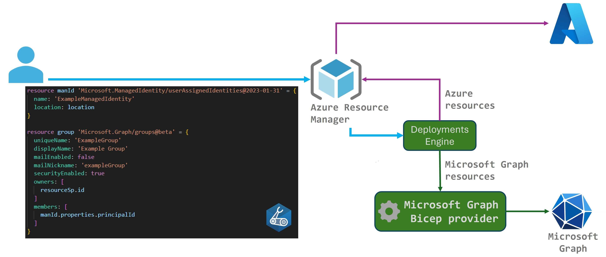

# Bicep templates for Microsoft Graph resources

Bicep templates for Microsoft Graph resources allow you to define the tenant infrastructure you want to deploy, such as groups or applications, in a file, then use the file throughout the development lifecycle to repeatedly deploy your infrastructure. The file uses the [Bicep](/azure/azure-resource-manager/bicep/overview) language, a domain-specific language (DSL) that uses declarative syntax to deploy resources, typically for your [infrastructure-as-code](/devops/deliver/what-is-infrastructure-as-code) solutions.

Suppose you want to [call custom APIs from Azure Logic Apps](https://github.com/Azure/azure-quickstart-templates/tree/master/quickstarts/microsoft.logic/logic-app-custom-api) where the web app is secured using Microsoft Entra ID. To create the two application identities for the logic app and the web app, you can define the Microsoft Graph application and service principal resources in a Bicep file, instead of creating them manually beforehand. In the same file, you can define the logic app and web app resources. Then, you can repeatedly deploy the file throughout the development lifecycle and have confidence that all your Azure and Microsoft Graph resources are deployed consistently.

[!INCLUDE [preview-alert](../includes/preview-alert.md)]

## Microsoft Graph Bicep provider

Bicep was originally created to provide an improved authoring experience over Azure Resource Manager JSON templates, for deployment and management of Azure resources. Bicep extensibility extends the original capability, allowing Bicep templates to reference resources outside of Azure Resource Manager.

Using Bicep extensibility, the new _Microsoft Graph Bicep provider_ allows you to author, deploy, and manage a limited set of Microsoft Graph resources (currently Microsoft Entra ID resources) in Bicep template files, alongside Azure resources.

- Azure customers can use familiar tools to deploy Azure resources together with the Microsoft Graph resources they depend on, such as applications and service principals, using Infrastructure-as-Code (IaC) and DevOps practices.
- It also opens the door for existing Microsoft Graph customers to use Bicep templates and IaC practices to deploy and manage their tenant's resources.

### Benefits of the Microsoft Graph Bicep provider

- **Authoring experience**: You get the same first-class authoring experience that's supported in the [Bicep Extension for VS Code](https://marketplace.visualstudio.com/items?itemName=ms-azuretools.vscode-bicep) when you use it to create your Bicep files. The editor provides rich type-safety, intellisense, and syntax validation.

  

  You can also create Bicep files in Visual Studio with the [Bicep extension for Visual Studio](https://marketplace.visualstudio.com/items?itemName=ms-azuretools.visualstudiobicep).

- **Support for both beta and v1.0 API versions**: The Microsoft Graph Bicep provider allows you to reference both beta and v1.0 versions of supported Microsoft Graph resource types within the same Bicep file.

- **Repeatable results**: Repeatedly deploy your infrastructure throughout the development lifecycle and have confidence your resources are deployed in a consistent manner. Bicep files are idempotent, which means you can deploy the same file many times and get the same resource types in the same state. You can develop one file that represents the desired state, rather than developing lots of separate files to represent updates.

- **Orchestration**: You don't have to worry about the complexities of ordering operations. Resource Manager orchestrates the deployment of interdependent resources so they're created in the correct order. When possible, Resource Manager deploys resources in parallel so your deployments finish faster than serial deployments. You deploy the file through one command, rather than through multiple imperative commands.

## Get started

To start with Bicep:

1. Understand [Bicep](/azure/azure-resource-manager/bicep/overview) and its uses.
1. **Install the tools**. See [Set up Bicep development and deployment environments](/azure/azure-resource-manager/bicep/install). Or, you can use the [VS Code Devcontainer/Codespaces repo](https://github.com/Azure/vscode-remote-try-bicep) to get a preconfigured authoring environment.
1. **Complete the [Bicep quickstart](/azure/azure-resource-manager/bicep/quickstart-create-bicep-use-visual-studio-code?tabs=CLI)** and the **[Learn modules for Bicep](/azure/azure-resource-manager/bicep/learn-bicep)**.

To start with Microsoft Graph:

1. Learn about [Microsoft Graph](/graph/overview).
1. Understand [authentication and authorization principles](/graph/auth) in Microsoft Graph.
1. Try the [Microsoft Graph tutorials](/graph/tutorials).

Once you're comfortable with both Bicep and Microsoft Graph:

1. Complete the [Microsoft Graph Bicep quickstart](./quickstart-create-bicep-interactive-mode.md) to author your first Bicep file containing Microsoft Graph resources, and deploy the file.
2. To learn about the Microsoft Graph Bicep types that are available for use in your Bicep files, see [Microsoft Graph Bicep resource reference](/graph/templates/reference).

## Related content

- Get started with the [Quickstart](./quickstart-create-bicep-interactive-mode.md) to author your first Bicep file containing Microsoft Graph resources.
