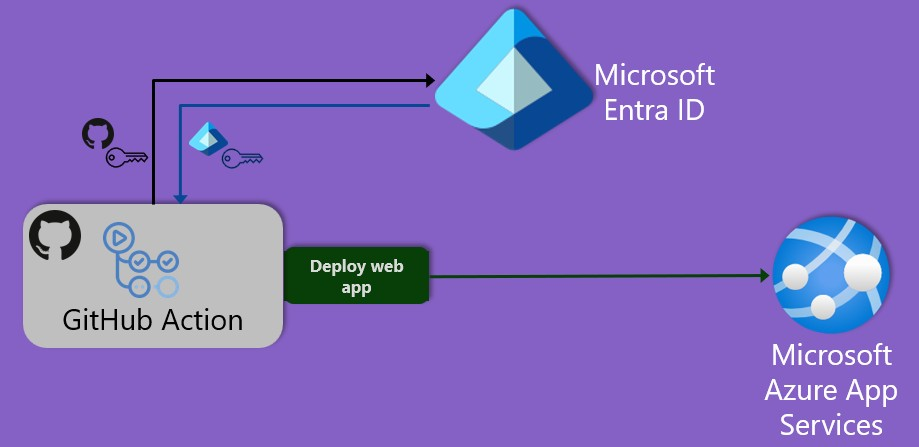

# Configure federated identity credential for GitHub Actions

The following video demonstrates the an end-to-end scenario of configuring workload identity federation and a GitHub Action workflow, so that the GitHub Action can log into Microsoft Entra, build and deploy a web app into an Azure App Service. This is all accomplished **without the use of any secrets**.

https://github.com/user-attachments/assets/59bb0901-858d-407c-bd54-39b557b01e99

## Details



This template enables a GitHub Actions workflow to exchange a GitHub access token for a Microsoft Entra ID access token, so that the GitHub Actions workflow can access Azure resources. To enable this, the template creates an application (to represent the GitHub Action) and configures it with a federated identity credential. When the GitHub Actions workflow requests to exchange a GitHub access token for an access token, from the Microsoft identity platform, the values in the federated identity credential are checked against the provided GitHub token's `issuer` and `subject` claim values.

* `subject` identifies the GitHub organization, repo, branch, and environment for your GitHub Actions workflow. Refer to [example subject claims](https://docs.github.com/actions/deployment/security-hardening-your-deployments/about-security-hardening-with-openid-connect#example-subject-claims) which describes the `subject` value options for different scenarios.

For limitations on federated identity credentials, please refer to [Federated identity credentials considerations and limitations](https://learn.microsoft.com/entra/workload-id/workload-identity-federation-considerations).

### Prerequisites

* Ownership of a GitHub repo.
* Have a valid **Azure subscription**: If you don't own an Azure subscription, [create a free account](https://azure.microsoft.com/free/) before you begin.
* [Bicep tools for authoring and deployment](https://learn.microsoft.com/graph/templates/quickstart-install-bicep-tools). The minimum required Bicep version is [v0.32.4](https://github.com/Azure/bicep/releases/tag/v0.32.4).
* Have a **Microsoft Entra role** that assigns you permissions to create applications. [Users have this permission by default](https://learn.microsoft.com/entra/fundamentals/users-default-permissions#compare-member-and-guest-default-permissions). However, [admins can turn off this default](https://learn.microsoft.com/entra/fundamentals/users-default-permissions#restrict-member-users-default-permissions) in which case you need to be assigned at least the [Application Developer](https://learn.microsoft.com/entra/identity/role-based-access-control/permissions-reference#application-developer) role.

### Deploy the Bicep template

You can deploy the template with the following Azure CLI command (replace `<resource-group>` with name of your resource group, and `<github-actions-fic-subject>` with the `subject` based on your scenario.):

```sh
az deployment group create --resource-group <resource-group> --template-file main.bicep --parameter gitHubOwner='<github-owner>' gitHubRepo='<github-repo-name>'
```

To deploy the same template using Az Powershell, use:

```powershell
New-AzResourceGroupDeployment -ResourceGroupName <resource-group> -TemplateFile .\main.bicep -gitHubOwner '<github-owner>' -gitHubRepo '<github-repo-name>'
```

### Configure GitHub

The Bicep template sample **only** configures the Microsoft Entra ID portion (to enable workload identity federation) and assigns the GitHub Action the Azure Contributor Role scoped to a resource group, which will allow it to deploy a web app to Azure App Services.

Additional configuration steps are also required on the GitHub side, to ensure that the federation works end-to-end. See [Use GitHub Actions to connect to Azure](https://learn.microsoft.com/azure/developer/github/connect-from-azure?tabs=azure-cli%2Cwindows#use-the-azure-login-action-with-openid-connect), but skip the sections on "Create a Microsoft Entra application and service principal" and "Add federated credentials", as the Bicep template replaces those sections. Essentially it requires

1. Creating a GitHub secret based on the GitHub Actions `appId`, that's output by running the Bicep template and
2. Creating a GitHub Actions workflow which logs the GitHub Action in and deploys the web app.  We've supplied the **publish.yml** example.
